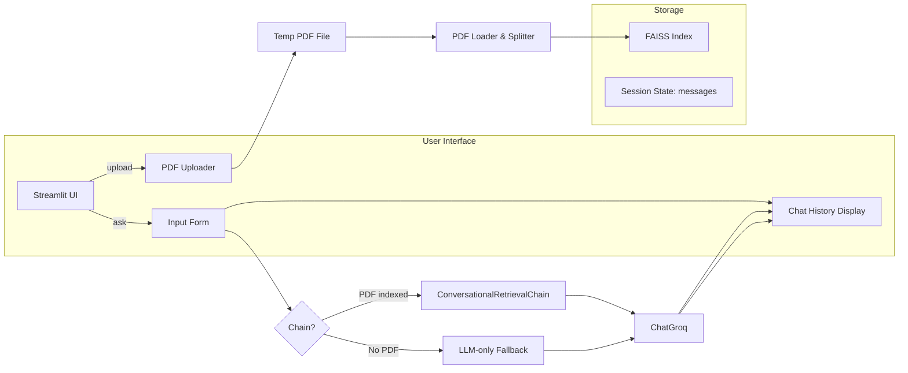

# 📄 PDF Chatbot 🤖

An AI-powered Streamlit application that lets you **chat with any PDF** and retain conversational context across turns. Leveraging LangChain, FAISS, and Groq’s hosted LLM, this tool transforms static documents into interactive knowledge assistants.

---

## ✨ Overview

PDF Chatbot ingests a PDF file, indexes its contents into a vector store, and answers user queries by combining:

1. 🔍 **Retrieval**  
   FAISS-powered semantic search over PDF embeddings  
2. 🧠 **Generation**  
   Groq’s `ChatGroq` LLM for fluent, on-point responses  
3. 💬 **Memory**  
   Session-state storage of prior messages to handle follow-ups naturally  

The result is a responsive Q&A interface that “remembers” what you’ve already asked and refers back to the document when needed.

---

## 🚀 Features

- **Document Understanding**  
  - Splits PDF pages into chunks, embeds them via a pretrained HuggingFace model, and indexes with FAISS for lightning-fast lookups.

- **Conversational Memory**  
  - Stores each user and bot turn in session state so follow-up questions (“What about the previous section?”) stay in context.

- **Seamless LLM Integration**  
  - Sends both retrieved document snippets and chat history to Groq’s hosted model (`ChatGroq`)—no GPU setup or local model downloads.

- **On-Demand PDF Indexing**  
  - Upload any PDF in the sidebar; once indexed, you can immediately begin querying its content.

- **Single-File Deployment**  
  - All logic lives in `app.py`; configuration via `.env` (for local) or Streamlit secrets (for production).

---

## 🏗️ Architecture

## 📂 Folder Structure
qna-chatbot/ 
├── app.py                   # Streamlit app entrypoint 
├── requirements.txt         # Python dependencies 
├── .gitignore               # Ignores .env, cache files 
├── .env                     # Local-only secrets (git-ignored) 
└── .streamlit/ 
    *  └── secrets.toml         # Placeholder for production secrets 

## 🎯 Usage
1. Upload a PDF via the left sidebar.
2. Ask any question about its contents in the chat box and hit Send.
3. Follow up with additional queries—your previous messages and the document context are woven into each answer.

## 🔒 Security & Secrets
**Local: store GROQ_API_KEY and GROQ_MODEL in a .env file (ignored by Git).**
**Production: configure the same keys in Streamlit Cloud’s Settings → Secrets (or commit a secrets.toml with placeholder values).**
